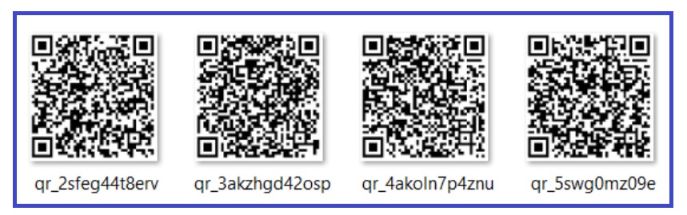

# Práca s QR- kódmi – Python

V istej nemenovanej firme si ekonómka ukladá do svojho adresára v počítači QR kódy
vo formáte png a niekedy aj vo formáte jpg. Ukladá ich celý jeden kalendárny rok. Má ich
veľmi veľa. Každý QR kód je napísaný jednoduchým textom a obsahuje napr. takéto údaje:

    Cena: 258 €
    Tovar: Nočná lampa LKJ 254, v.č: 124856

Vašou úlohou je napísať kód pre ekonómku, ktorý by jej uľahčil prácu s manipuláciou
s jednotlivými QR kódmi. Adresár : QR_KODY je k dispozícii

## Úloha:
*Napr. šéf firmy si poprosí stručný prehľad výrobkov, ktoré boli zakúpené za cenu
vyššiu ako 300 €. (Cena môže byť ľubovoľná) Ekonómka mu dodá jeho splnenú
požiadavku.*

Teda napr.

    Produkty s cennou vyššou ako 300 € sú:
    Počet produktov: 2

    qr_kod_bločku: qr_49wccm3a9uo8.png
    Cena: 510.0 EUR
    Tovar: notebook delpfi 2f8, v.č. 369544

    qr_kod_bločku: qr_z0ep0rp3g3g.png
    Cena: 322.0 EUR
    Tovar: Mobilná klima, v.č. 2588

## ROZBOR ÚLOHY

    A) Najprv vytvoríme súbor q1.py - bude slúžiť na načítanie qr kodov, dekódovanie a ich tlač
    B) Navrhneme konkrétne riešenie pre naše zadanie úlohy (q2.py)
    C) Vylepšíme, resp. upravíme riešenie z bodu B (q3.py)

    A1) Funkcia na načítanie a dekódovanie QR kódu z obrázka
    A2) Prechádzanie cez načitané a dekodované udaje
        A2.1) Rozdelenie údajov na názov súboru a detaily produktu
        A2.2) Tlač rozdelených údajov

## Čo budeme potrebovať ? (BOD A)
    cv2: Modul OpenCV pre zpracovánie obrazu.
    os: Modul pre prácu so súborovým systémom.

- cv2.imread(image_path): Načíta obrázok z danéj cesty.
- cv2.QRCodeDetector().detectAndDecode(img): Detekuje a dekóduje QR kód v obrázku.

 - os.listdir(directory): Vrátí zoznam všetkých souborov v danom adresári.
 - filename.lower().endswith(('.png', '.jpg')): Filtruje súbory s príponami .png a .jpg.
 - os.path.join(directory, filename): Vytvorí úplnu cestu k súboru.

 ## Čo budeme potrebovať ? (BOD B)
    sys - Modul (na predčasne ukončenie ak je nesprávne zadaná cena) + predošle cv2 a os

## ROZBOR ÚLOHY

    B1) Využijeme to čo máme v bode A (q1.py)
    B2) Funkcia na extrahovanie ceny a názvu tovaru z textu
    B3) Zadanie ceny na vstupe
    B4) Nastavíme filter (if) podľa hľadanej ceny
    B5) Tlač údajov, ktoré splňajú podmienku

## Čo budeme potrebovať v bode C ?
    C1) Použijeme to čo máme v bode B (q2.py)
    C2) Presunieme časti kódu, ktoré nie sú vo funkcii do novej funkcie
    C3) Volanie finálneho riešenia sa zprehľadni a skráti

